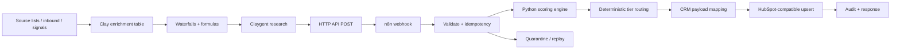

# GTM Revenue Engine

A production-style go-to-market orchestration system that turns multi-source prospect data into normalized, deduplicated, enriched, scored, routed, CRM-ready opportunities using Clay, n8n, Python/pandas, APIs/webhooks, and LLM-assisted research.

The repository is designed to demonstrate the engineering layer behind repeatable revenue operations: data quality, enrichment strategy, signal scoring, workflow reliability, routing, CRM hygiene, and handoff documentation.

## What this demonstrates

- Clay table design for multi-source prospect data, enrichment waterfalls, formulas, conditional runs, freshness fields, and Claygent research.
- n8n orchestration with webhook ingress, validation, deterministic idempotency keys, retries, quarantine, scoring, routing, CRM upsert, and structured responses.
- Python/pandas normalization, deduplication, missing-value handling, explainable composite scoring, and deterministic routing.
- HubSpot-compatible company/contact payloads with source attribution, score, tier, route, and sync metadata.
- Offline-safe local execution through a deterministic mock CRM adapter.
- Explicit failure-mode planning for duplicate delivery, stale signals, partial enrichment, rate limits, timeouts, invalid AI output, and partial failures.
- Documentation intended for engineering, RevOps, and GTM stakeholders—not only the original builder.

## Architecture



Detailed design: [`docs/architecture.md`](docs/architecture.md)

## Composite score

The score is deliberately explainable rather than an opaque model.

| Signal group | Maximum |
|---|---:|
| Firmographic fit | 25 |
| Technographic fit | 15 |
| Hiring signal | 15 |
| Funding / growth signal | 15 |
| Intent signal | 20 |
| Behavioral signal | 10 |
| **Total** | **100** |

Thresholds and freshness windows live in [`config/scoring.yaml`](config/scoring.yaml), not inside business logic.

Routing defaults:

- **Tier A, 80-100:** immediate sales routing
- **Tier B, 60-79:** targeted outbound
- **Tier C, 40-59:** enrich further
- **LOW, <40:** low-priority nurture

## Run the offline demo

### Windows PowerShell

```powershell
Set-ExecutionPolicy -Scope Process Bypass
.\scripts\demo.ps1
```

### Cross-platform Python

```bash
python -m pip install -e ".[dev]"
python -m pytest -q
python -m gtm_engine.cli demo \
  --input data/sample_prospects.csv \
  --output artifacts \
  --config config/scoring.yaml
```

The demo does not need a Clay, HubSpot, OpenAI, or paid enrichment account. It writes:

- `artifacts/processed_prospects.json`
- `artifacts/summary.json`

## Run the HTTP service used by n8n

The repository includes a small FastAPI adapter over the same scoring and CRM code used by the offline demo. From the repository root:

```bash
python -m pip install -e ".[dev]"
python -m gtm_engine.api
```

Health check: `GET http://localhost:8000/health`

The n8n workflow expects:

- `GTM_ENGINE_SCORE_URL=http://localhost:8000/score`
- `GTM_CRM_UPSERT_URL=http://localhost:8000/crm/upsert`

The safe default is `GTM_CRM_MODE=mock`. Set `GTM_CRM_MODE=hubspot` and provide `HUBSPOT_ACCESS_TOKEN` only when intentionally testing a real CRM.

## Connect the real GTM stack

1. Start the HTTP service above and verify `/health`.
2. Build the Clay workbook/table described in [`docs/clay-setup.md`](docs/clay-setup.md).
3. Import [`n8n/gtm-revenue-engine.workflow.json`](n8n/gtm-revenue-engine.workflow.json).
4. Configure the n8n environment variables from [`.env.example`](.env.example).
5. Create the custom CRM fields mapped in [`docs/crm-mapping.md`](docs/crm-mapping.md).
6. Test with non-production data, including replay and duplicate-delivery cases.
7. Activate the workflow only after the failure-mode checks in [`docs/runbook.md`](docs/runbook.md) pass.

## Repository map

```text
config/        scoring and freshness policy
data/          safe sample prospects and enriched examples
docs/          architecture, Clay setup, CRM mapping, failure modes, handoff, runbook
n8n/           sanitized importable orchestration workflow
scripts/       one-command PowerShell demo
src/gtm_engine deterministic transformation, scoring, routing, CRM, CLI and FastAPI code
tests/         behavior and repository contract tests
```

## Reliability principles

- APIs and webhooks are explicit integration boundaries.
- Idempotency is generated before downstream actions.
- Duplicate inputs are collapsed before scoring and CRM writes.
- Signal freshness changes score contribution instead of silently treating old data as current.
- AI/Claygent output supplies research context; critical routing thresholds remain deterministic.
- Transient 429/5xx failures are retryable; malformed input is quarantined rather than retried forever.
- Local demo paths never require production credentials.

## Role relevance

This project is intentionally reusable rather than built around one employer. It demonstrates the technical range expected in GTM engineering and revenue-systems work: enrichment, workflow automation, APIs/webhooks, data transformation, LLM-assisted research, CRM operations, reliability, measurement, and documentation.

## Security

No credentials, provider tokens, customer lists, or production records are committed. Copy `.env.example` to `.env` locally if connecting real services. The default execution path uses `MockCRMAdapter`.

## License

MIT.
