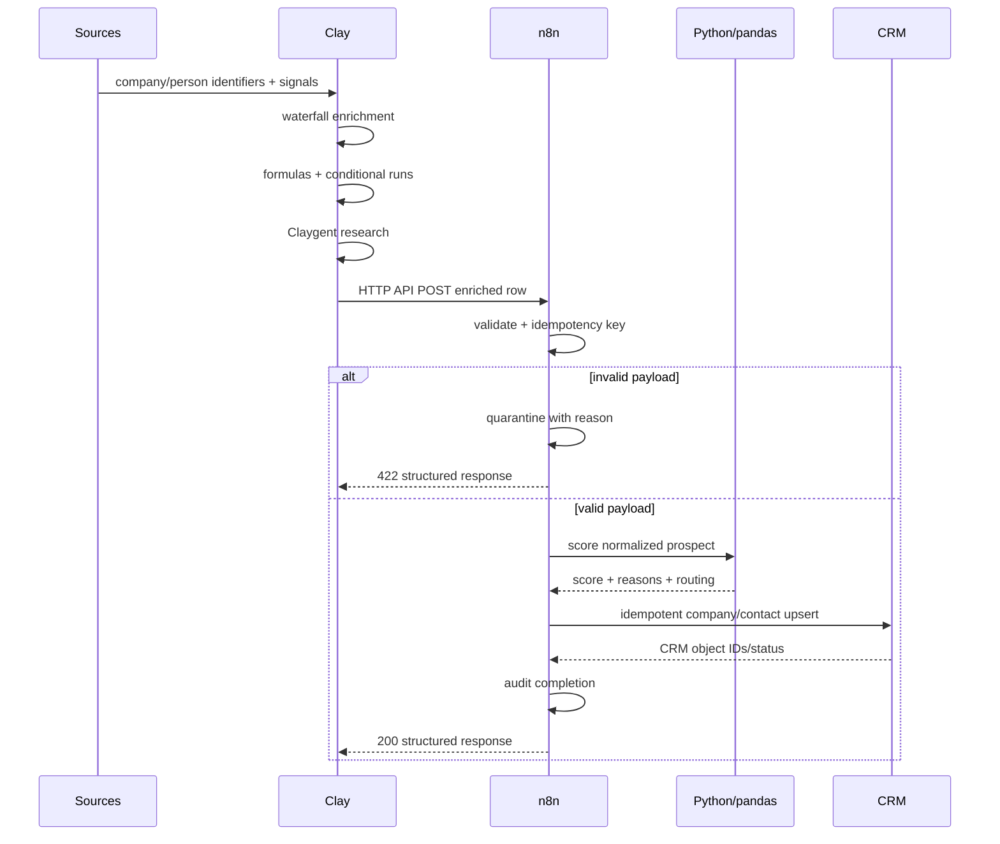

# Architecture

## System objective

Convert raw or partially enriched prospects into a consistent operational record with an explainable score, a routing decision, and a replay-safe CRM write.

## Boundaries

### Clay: data and enrichment

Clay owns source aggregation, provider waterfall selection, row-level enrichment, conditional execution, formulas, freshness metadata, and semantic research where public web context is needed.

### n8n: orchestration

n8n owns ingress, schema checks, workflow state, retries, quarantine, endpoint coordination, and operational response behavior. The public workflow JSON is sanitized and uses environment-driven endpoints.

### Python/pandas: deterministic logic

Python owns transformations that benefit from source control and tests: normalization, deduplication, missing-value handling, score calculation, freshness penalties, routing, and CRM payload mapping.

### CRM: durable commercial state

The CRM remains the system of record for company/contact objects, ownership/routing fields, source attribution, score/tier, and sync status. The local path uses a mock adapter so clone-and-run behavior never depends on an external account.

## Idempotency

The Python pipeline creates a SHA-256 key from schema version, normalized company identity, and source record ID. The n8n artifact creates an equivalent deterministic pre-write key from the inbound identity. In production, persist the key in an audit/event store and reject already-completed writes; retries for incomplete events may reuse the same key.

## Observability contract

Every processed event should expose:

- idempotency key
- source/source record ID
- normalized company identity
- score and component reasons
- tier/action/owner
- CRM object IDs
- workflow status
- timestamps
- failure reason when quarantined

The portfolio workflow demonstrates these fields without embedding a vendor-specific monitoring dependency.
